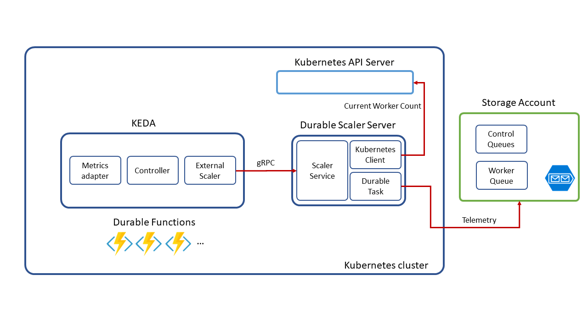

## Durable Functions

Durable Functions is an extension of Azure Functions that enables you to perform long-lasting, stateful operations in Azure. Azure provides the infrastructure for maintaining state information. You can use Durable Functions to orchestrate a long-running workflow. Using this approach, you get all the benefits of a serverless hosting model, while letting the Durable Functions framework take care of activity monitoring, synchronization, and runtime concerns.

## Tutorial

#### 1. Create a new directory for the function app

```cli
mkdir DurableFunction
cd DurableFunction
```

#### 2. Initialize the directory for functions

```cli
func init . --docker
```

Select **dotnet**

#### 3. Add a new durable function

```cli
func new
```

Select **DurableFunctionsOrchestration** then select a name for your function.

## 4. Run function


```cli
func start
```

## What is KEDA Durable Functions Scaler?

KEDA supports [multiple scalers](https://github.com/kedacore/keda). As a part of the scalers, this project support Durable Functions Scaler for KEDA. You can deploy Durable Functions with auto scale feature on Kubernetes.

## How KEDA Durable Functions Scaler works

KEDA Durable Functions Scaler works as a gRPC server of the [External Scaler Support](https://github.com/kedacore/keda/pull/294).

* [gRPC services with ASP.NET Core](https://docs.microsoft.com/en-us/aspnet/core/grpc/aspnetcore?view=aspnetcore-3.0&tabs=visual-studio)
* Watch Control/Worker queues by DurableTask and use [Scale Recommendation](https://github.com/Azure/durabletask/blob/master/src/DurableTask.AzureStorage/Monitoring/DisconnectedPerformanceMonitor.cs#L89)
* Get the current worker count from Kubernetes API Server



### Limitations

#### Minimum Pod number is 1. Not zero.

Currently, KEDA Durable Scaler can't make functions scale down to zero. The minimum pod number is one. Durable Scaler needs to send data to the control/worker queue. To achieve this behavior, we need to separate the HTTP and non-HTTP deployments. However, the feature seems not working. We need to wait until this issue is fixed.